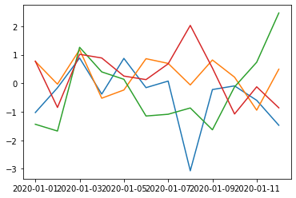
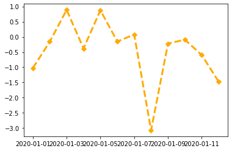
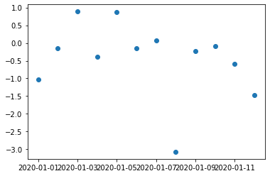
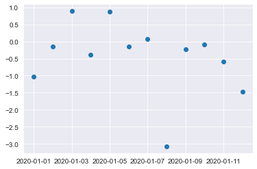

### Series


```python
import numpy as np
import pandas as pd

# 从列表创建Series
pd.Series(['a', 'b', 'c'])
```


    0    a
    1    b
    2    c
    dtype: object


```python
# import pandas as pd
# 通过字典创建带索引的Series
s1 = pd.Series({'a':11, 'b':22, 'c':33})
print(s1)
```

    a    11
    b    22
    c    33
    dtype: int64


```python
# 通过关键字创建带索引的Series
s2 = pd.Series([111, 222, 333], index = ['a', 'b', 'c'])
print(s2)
```

    a    111
    b    222
    c    333
    dtype: int64


**Hint:**
使用index会提升查询性能

+ 如果index唯一，pandas会使用<span class="mark">哈希表</span>优化，查询性能为O(1)
+ 如果index有序不唯一，pandas会使用<span class="mark">二分查找</span>算法，查询性能为O(logN)
+ 如果index完全随机，每次查询都要扫全表，查询性能为O(N)


```python
# 获取全部索引
s1.index
```


    Index(['a', 'b', 'c'], dtype='object')


```python
# 获取全部值
s2.values
```


    array([111, 222, 333])


```python
# 类型
type(s1.values)    
```


    numpy.ndarray


```python
# 转换为列表
s1.values.tolist()
```


    [11, 22, 33]


```python
# 取出email
emails = pd.Series(['abc at amazom.com', 'admin1@163.com', 'mat@m.at', 'ab@abc.com'])
import re
pattern ='[A-Za-z0-9._]+@[A-Za-z0-9.-]+\\.[A-Za-z]{2,5}'
mask = emails.map(lambda x: bool(re.match(pattern, x)))
emails[mask]
```


    1    admin1@163.com
    2          mat@m.at
    3        ab@abc.com
    dtype: object


### DataFrame（多行、多列）


```python
pd.DataFrame([[1,2],['a','b']])
```


<div>
<style scoped>
    .dataframe tbody tr th:only-of-type {
        vertical-align: middle;
    }

    .dataframe tbody tr th {
        vertical-align: top;
    }
    
    .dataframe thead th {
        text-align: right;
    }
</style>
<table border="1" class="dataframe">
  <thead>
    <tr style="text-align: right;">
      <th></th>
      <th>0</th>
      <th>1</th>
    </tr>
  </thead>
  <tbody>
    <tr>
      <th>0</th>
      <td>1</td>
      <td>2</td>
    </tr>
    <tr>
      <th>1</th>
      <td>a</td>
      <td>b</td>
    </tr>
  </tbody>
</table>
</div>


```python
df = pd.DataFrame([[1,2],['a','b']])
# 自定义列索引
df.columns= ['one', 'two']
print(df)
```

      one two
    0   1   2
    1   a   b


```python
df2 = pd.DataFrame([[1,2],['a','b']])
# 自定义行索引
df2.index = ['first', 'second']
print(df2)
```

            0  1
    first   1  2
    second  a  b


### 数据导入


```python
'''
导入csv 
'''
csv1 = pd.read_csv('../maoyan.csv')
print(csv1)
```

              天气之子     \n类型:\n              爱情／动画／奇幻\n              \
    0           误杀        \n类型:\n              剧情／犯罪\n               
    1       唐人街探案2     \n类型:\n              喜剧／动作／悬疑\n               
    2      哪吒之魔童降世     \n类型:\n              动画／喜剧／奇幻\n               
    3         少年的你     \n类型:\n              爱情／青春／剧情\n               
    4          毒液2  \n类型:\n              动作／科幻／惊悚／恐怖\n               
    5    哥斯拉2：怪兽之王     \n类型:\n              科幻／灾难／动作\n               
    6          战狼2        \n类型:\n              动作／战争\n               
    7       恐怖电影院2        \n类型:\n              恐怖／惊悚\n               
    8  复仇者联盟4：终局之战     \n类型:\n              动作／冒险／奇幻\n               
    
        \n主演:\n              醍醐虎汰朗／森七菜／本田翼\n              \
    0        \n主演:\n              肖央／谭卓／陈冲\n               
    1      \n主演:\n              王宝强／刘昊然／肖央\n               
    2     \n主演:\n              吕艳婷／囧森瑟夫／瀚墨\n               
    3     \n主演:\n              周冬雨／易烊千玺／尹昉\n               
    4  \n主演:\n              汤姆·哈迪／伍迪·哈里森／娜奥米·哈里斯\n   ...   
    5  \n主演:\n              凯尔·钱德勒／维拉·法梅加／米莉·波比·布朗\n ...   
    6   \n主演:\n              吴京／弗兰克·格里罗／吴刚\n               
    7     \n主演:\n              殷果儿／刘小奇／闫薇儿\n               
    8  \n主演:\n              小罗伯特·唐尼／克里斯·埃文斯／马克·鲁法洛\n ...   
    
       \n上映时间:\n              2019-11-01\n              
    0  \n上映时间:\n              2019-12-13\n              
    1  \n上映时间:\n              2018-02-16\n              
    2  \n上映时间:\n              2019-07-26\n              
    3  \n上映时间:\n              2019-10-25\n              
    4  \n上映时间:\n              2020-06-25\n              
    5  \n上映时间:\n              2019-05-31\n              
    6  \n上映时间:\n              2017-07-27\n              
    7  \n上映时间:\n              2017-10-20\n              
    8  \n上映时间:\n              2019-04-24\n              


```python
# 导入excel
excel1 = pd.read_excel('1.xlsx')
print(excel1)
```

       num1   num2  num3  num4
    0     1    4.0     5     7
    1    33    NaN    55    66
    2   111  222.0   333   444


```python
# 显示前几行
excel1.head(2)
```


<div>
<style scoped>
    .dataframe tbody tr th:only-of-type {
        vertical-align: middle;
    }

    .dataframe tbody tr th {
        vertical-align: top;
    }
    
    .dataframe thead th {
        text-align: right;
    }
</style>
<table border="1" class="dataframe">
  <thead>
    <tr style="text-align: right;">
      <th></th>
      <th>num1</th>
      <th>num2</th>
      <th>num3</th>
      <th>num4</th>
    </tr>
  </thead>
  <tbody>
    <tr>
      <th>0</th>
      <td>1</td>
      <td>4.0</td>
      <td>5</td>
      <td>7</td>
    </tr>
    <tr>
      <th>1</th>
      <td>33</td>
      <td>NaN</td>
      <td>55</td>
      <td>66</td>
    </tr>
  </tbody>
</table>
</div>


```python
# 行列数量
excel1.shape
```


    (3, 4)


```python
# 详细信息
excel1.info()
excel1.describe()
# type(excel1.describe())
```

    <class 'pandas.core.frame.DataFrame'>
    RangeIndex: 3 entries, 0 to 2
    Data columns (total 4 columns):
     #   Column  Non-Null Count  Dtype  
    ---  ------  --------------  -----  
     0   num1    3 non-null      int64  
     1   num2    2 non-null      float64
     2   num3    3 non-null      int64  
     3   num4    3 non-null      int64  
    dtypes: float64(1), int64(3)
    memory usage: 224.0 bytes


<div>
<style scoped>
    .dataframe tbody tr th:only-of-type {
        vertical-align: middle;
    }

    .dataframe tbody tr th {
        vertical-align: top;
    }
    
    .dataframe thead th {
        text-align: right;
    }
</style>
<table border="1" class="dataframe">
  <thead>
    <tr style="text-align: right;">
      <th></th>
      <th>num1</th>
      <th>num2</th>
      <th>num3</th>
      <th>num4</th>
    </tr>
  </thead>
  <tbody>
    <tr>
      <th>count</th>
      <td>3.000000</td>
      <td>2.000000</td>
      <td>3.000000</td>
      <td>3.000000</td>
    </tr>
    <tr>
      <th>mean</th>
      <td>48.333333</td>
      <td>113.000000</td>
      <td>131.000000</td>
      <td>172.333333</td>
    </tr>
    <tr>
      <th>std</th>
      <td>56.580326</td>
      <td>154.149278</td>
      <td>176.714459</td>
      <td>237.112491</td>
    </tr>
    <tr>
      <th>min</th>
      <td>1.000000</td>
      <td>4.000000</td>
      <td>5.000000</td>
      <td>7.000000</td>
    </tr>
    <tr>
      <th>25%</th>
      <td>17.000000</td>
      <td>58.500000</td>
      <td>30.000000</td>
      <td>36.500000</td>
    </tr>
    <tr>
      <th>50%</th>
      <td>33.000000</td>
      <td>113.000000</td>
      <td>55.000000</td>
      <td>66.000000</td>
    </tr>
    <tr>
      <th>75%</th>
      <td>72.000000</td>
      <td>167.500000</td>
      <td>194.000000</td>
      <td>255.000000</td>
    </tr>
    <tr>
      <th>max</th>
      <td>111.000000</td>
      <td>222.000000</td>
      <td>333.000000</td>
      <td>444.000000</td>
    </tr>
  </tbody>
</table>
</div>


```python
# 指定导入哪个Sheet
pd.read_excel(r'1.xlsx',sheet_name = 0)
```


<div>
<style scoped>
    .dataframe tbody tr th:only-of-type {
        vertical-align: middle;
    }

    .dataframe tbody tr th {
        vertical-align: top;
    }
    
    .dataframe thead th {
        text-align: right;
    }
</style>
<table border="1" class="dataframe">
  <thead>
    <tr style="text-align: right;">
      <th></th>
      <th>num1</th>
      <th>num2</th>
      <th>num3</th>
      <th>num4</th>
    </tr>
  </thead>
  <tbody>
    <tr>
      <th>0</th>
      <td>1</td>
      <td>4.0</td>
      <td>5</td>
      <td>7</td>
    </tr>
    <tr>
      <th>1</th>
      <td>33</td>
      <td>NaN</td>
      <td>55</td>
      <td>66</td>
    </tr>
    <tr>
      <th>2</th>
      <td>111</td>
      <td>222.0</td>
      <td>333</td>
      <td>444</td>
    </tr>
  </tbody>
</table>
</div>


```python
# 数据库读取
# import pymysql
# sql  =  'SELECT *  FROM mytable'
# conn = pymysql.connect('ip','name','pass','dbname','charset=utf8')
# df = pd.read_sql(sql,conn)
```

### 数据预处理


```python
x = pd.Series([1, 2, 3, np.nan, 4])
```


```python
# 是否有缺失值
x.hasnans
```


    True


```python
# 将缺省值填充为平均值
x.fillna(value=x.mean())
```


    0    1.0
    1    2.0
    2    3.0
    3    2.5
    4    4.0
    dtype: float64


```python
# 原有的内容不变
x
```


    0    1.0
    1    2.0
    2    3.0
    3    NaN
    4    4.0
    dtype: float64


```python
df3=pd.DataFrame({"A":[5,3,None,4], 
                 "B":[None,2,4,3], 
                 "C":[4,3,8,5], 
                 "D":[5,4,2,None]}) 
```


```python
df3
```


<div>
<style scoped>
    .dataframe tbody tr th:only-of-type {
        vertical-align: middle;
    }

    .dataframe tbody tr th {
        vertical-align: top;
    }
    
    .dataframe thead th {
        text-align: right;
    }
</style>
<table border="1" class="dataframe">
  <thead>
    <tr style="text-align: right;">
      <th></th>
      <th>A</th>
      <th>B</th>
      <th>C</th>
      <th>D</th>
    </tr>
  </thead>
  <tbody>
    <tr>
      <th>0</th>
      <td>5.0</td>
      <td>NaN</td>
      <td>4</td>
      <td>5.0</td>
    </tr>
    <tr>
      <th>1</th>
      <td>3.0</td>
      <td>2.0</td>
      <td>3</td>
      <td>4.0</td>
    </tr>
    <tr>
      <th>2</th>
      <td>NaN</td>
      <td>4.0</td>
      <td>8</td>
      <td>2.0</td>
    </tr>
    <tr>
      <th>3</th>
      <td>4.0</td>
      <td>3.0</td>
      <td>5</td>
      <td>NaN</td>
    </tr>
  </tbody>
</table>
</div>


```python
df3.isnull() # 查看缺失值汇总
```


<div>
<style scoped>
    .dataframe tbody tr th:only-of-type {
        vertical-align: middle;
    }

    .dataframe tbody tr th {
        vertical-align: top;
    }
    
    .dataframe thead th {
        text-align: right;
    }
</style>
<table border="1" class="dataframe">
  <thead>
    <tr style="text-align: right;">
      <th></th>
      <th>A</th>
      <th>B</th>
      <th>C</th>
      <th>D</th>
    </tr>
  </thead>
  <tbody>
    <tr>
      <th>0</th>
      <td>False</td>
      <td>True</td>
      <td>False</td>
      <td>False</td>
    </tr>
    <tr>
      <th>1</th>
      <td>False</td>
      <td>False</td>
      <td>False</td>
      <td>False</td>
    </tr>
    <tr>
      <th>2</th>
      <td>True</td>
      <td>False</td>
      <td>False</td>
      <td>False</td>
    </tr>
    <tr>
      <th>3</th>
      <td>False</td>
      <td>False</td>
      <td>False</td>
      <td>True</td>
    </tr>
  </tbody>
</table>
</div>


```python
df3.isnull().sum() # 查看缺失值汇总
```


    A    1
    B    1
    C    0
    D    1
    dtype: int64


```python
df3.ffill() #用上一行填充
```


<div>
<style scoped>
    .dataframe tbody tr th:only-of-type {
        vertical-align: middle;
    }

    .dataframe tbody tr th {
        vertical-align: top;
    }
    
    .dataframe thead th {
        text-align: right;
    }
</style>
<table border="1" class="dataframe">
  <thead>
    <tr style="text-align: right;">
      <th></th>
      <th>A</th>
      <th>B</th>
      <th>C</th>
      <th>D</th>
    </tr>
  </thead>
  <tbody>
    <tr>
      <th>0</th>
      <td>5.0</td>
      <td>NaN</td>
      <td>4</td>
      <td>5.0</td>
    </tr>
    <tr>
      <th>1</th>
      <td>3.0</td>
      <td>2.0</td>
      <td>3</td>
      <td>4.0</td>
    </tr>
    <tr>
      <th>2</th>
      <td>3.0</td>
      <td>4.0</td>
      <td>8</td>
      <td>2.0</td>
    </tr>
    <tr>
      <th>3</th>
      <td>4.0</td>
      <td>3.0</td>
      <td>5</td>
      <td>2.0</td>
    </tr>
  </tbody>
</table>
</div>


```python
df3.ffill().ffill(axis=1) # 用前一列填充
```


<div>
<style scoped>
    .dataframe tbody tr th:only-of-type {
        vertical-align: middle;
    }

    .dataframe tbody tr th {
        vertical-align: top;
    }
    
    .dataframe thead th {
        text-align: right;
    }
</style>
<table border="1" class="dataframe">
  <thead>
    <tr style="text-align: right;">
      <th></th>
      <th>A</th>
      <th>B</th>
      <th>C</th>
      <th>D</th>
    </tr>
  </thead>
  <tbody>
    <tr>
      <th>0</th>
      <td>5.0</td>
      <td>5.0</td>
      <td>4.0</td>
      <td>5.0</td>
    </tr>
    <tr>
      <th>1</th>
      <td>3.0</td>
      <td>2.0</td>
      <td>3.0</td>
      <td>4.0</td>
    </tr>
    <tr>
      <th>2</th>
      <td>3.0</td>
      <td>4.0</td>
      <td>8.0</td>
      <td>2.0</td>
    </tr>
    <tr>
      <th>3</th>
      <td>4.0</td>
      <td>3.0</td>
      <td>5.0</td>
      <td>2.0</td>
    </tr>
  </tbody>
</table>
</div>


```python
df3
```


<div>
<style scoped>
    .dataframe tbody tr th:only-of-type {
        vertical-align: middle;
    }

    .dataframe tbody tr th {
        vertical-align: top;
    }
    
    .dataframe thead th {
        text-align: right;
    }
</style>
<table border="1" class="dataframe">
  <thead>
    <tr style="text-align: right;">
      <th></th>
      <th>A</th>
      <th>B</th>
      <th>C</th>
      <th>D</th>
    </tr>
  </thead>
  <tbody>
    <tr>
      <th>0</th>
      <td>5.0</td>
      <td>NaN</td>
      <td>4</td>
      <td>5.0</td>
    </tr>
    <tr>
      <th>1</th>
      <td>3.0</td>
      <td>2.0</td>
      <td>3</td>
      <td>4.0</td>
    </tr>
    <tr>
      <th>2</th>
      <td>NaN</td>
      <td>4.0</td>
      <td>8</td>
      <td>2.0</td>
    </tr>
    <tr>
      <th>3</th>
      <td>4.0</td>
      <td>3.0</td>
      <td>5</td>
      <td>NaN</td>
    </tr>
  </tbody>
</table>
</div>


```python
# 缺失值删除
df3.info()
df3.dropna()
```

    <class 'pandas.core.frame.DataFrame'>
    RangeIndex: 4 entries, 0 to 3
    Data columns (total 4 columns):
     #   Column  Non-Null Count  Dtype  
    ---  ------  --------------  -----  
     0   A       3 non-null      float64
     1   B       3 non-null      float64
     2   C       4 non-null      int64  
     3   D       3 non-null      float64
    dtypes: float64(3), int64(1)
    memory usage: 256.0 bytes


<div>
<style scoped>
    .dataframe tbody tr th:only-of-type {
        vertical-align: middle;
    }

    .dataframe tbody tr th {
        vertical-align: top;
    }
    
    .dataframe thead th {
        text-align: right;
    }
</style>
<table border="1" class="dataframe">
  <thead>
    <tr style="text-align: right;">
      <th></th>
      <th>A</th>
      <th>B</th>
      <th>C</th>
      <th>D</th>
    </tr>
  </thead>
  <tbody>
    <tr>
      <th>1</th>
      <td>3.0</td>
      <td>2.0</td>
      <td>3</td>
      <td>4.0</td>
    </tr>
  </tbody>
</table>
</div>


```python
# 填充缺失值
df3.fillna('无')
```


<div>
<style scoped>
    .dataframe tbody tr th:only-of-type {
        vertical-align: middle;
    }

    .dataframe tbody tr th {
        vertical-align: top;
    }
    
    .dataframe thead th {
        text-align: right;
    }
</style>
<table border="1" class="dataframe">
  <thead>
    <tr style="text-align: right;">
      <th></th>
      <th>A</th>
      <th>B</th>
      <th>C</th>
      <th>D</th>
    </tr>
  </thead>
  <tbody>
    <tr>
      <th>0</th>
      <td>5</td>
      <td>无</td>
      <td>4</td>
      <td>5</td>
    </tr>
    <tr>
      <th>1</th>
      <td>3</td>
      <td>2</td>
      <td>3</td>
      <td>4</td>
    </tr>
    <tr>
      <th>2</th>
      <td>无</td>
      <td>4</td>
      <td>8</td>
      <td>2</td>
    </tr>
    <tr>
      <th>3</th>
      <td>4</td>
      <td>3</td>
      <td>5</td>
      <td>无</td>
    </tr>
  </tbody>
</table>
</div>


```python
# 重复值处理
df3.drop_duplicates()
```


<div>
<style scoped>
    .dataframe tbody tr th:only-of-type {
        vertical-align: middle;
    }

    .dataframe tbody tr th {
        vertical-align: top;
    }
    
    .dataframe thead th {
        text-align: right;
    }
</style>
<table border="1" class="dataframe">
  <thead>
    <tr style="text-align: right;">
      <th></th>
      <th>A</th>
      <th>B</th>
      <th>C</th>
      <th>D</th>
    </tr>
  </thead>
  <tbody>
    <tr>
      <th>0</th>
      <td>5.0</td>
      <td>NaN</td>
      <td>4</td>
      <td>5.0</td>
    </tr>
    <tr>
      <th>1</th>
      <td>3.0</td>
      <td>2.0</td>
      <td>3</td>
      <td>4.0</td>
    </tr>
    <tr>
      <th>2</th>
      <td>NaN</td>
      <td>4.0</td>
      <td>8</td>
      <td>2.0</td>
    </tr>
    <tr>
      <th>3</th>
      <td>4.0</td>
      <td>3.0</td>
      <td>5</td>
      <td>NaN</td>
    </tr>
  </tbody>
</table>
</div>


### 数据的调整


```python
# 行列调整
df4 = pd.DataFrame({"A":[5,3,None,4], 
                 "B":[None,2,4,3], 
                 "C":[4,3,8,5], 
                 "D":[5,4,2,None]}) 
df4
```


<div>
<style scoped>
    .dataframe tbody tr th:only-of-type {
        vertical-align: middle;
    }

    .dataframe tbody tr th {
        vertical-align: top;
    }
    
    .dataframe thead th {
        text-align: right;
    }
</style>
<table border="1" class="dataframe">
  <thead>
    <tr style="text-align: right;">
      <th></th>
      <th>A</th>
      <th>B</th>
      <th>C</th>
      <th>D</th>
    </tr>
  </thead>
  <tbody>
    <tr>
      <th>0</th>
      <td>5.0</td>
      <td>NaN</td>
      <td>4</td>
      <td>5.0</td>
    </tr>
    <tr>
      <th>1</th>
      <td>3.0</td>
      <td>2.0</td>
      <td>3</td>
      <td>4.0</td>
    </tr>
    <tr>
      <th>2</th>
      <td>NaN</td>
      <td>4.0</td>
      <td>8</td>
      <td>2.0</td>
    </tr>
    <tr>
      <th>3</th>
      <td>4.0</td>
      <td>3.0</td>
      <td>5</td>
      <td>NaN</td>
    </tr>
  </tbody>
</table>
</div>


#### 选择


```python
# 列的选择,多个列要用列表
df4[ ['A', 'D'] ]
```


<div>
<style scoped>
    .dataframe tbody tr th:only-of-type {
        vertical-align: middle;
    }

    .dataframe tbody tr th {
        vertical-align: top;
    }
    
    .dataframe thead th {
        text-align: right;
    }
</style>
<table border="1" class="dataframe">
  <thead>
    <tr style="text-align: right;">
      <th></th>
      <th>A</th>
      <th>D</th>
    </tr>
  </thead>
  <tbody>
    <tr>
      <th>0</th>
      <td>5.0</td>
      <td>5.0</td>
    </tr>
    <tr>
      <th>1</th>
      <td>3.0</td>
      <td>4.0</td>
    </tr>
    <tr>
      <th>2</th>
      <td>NaN</td>
      <td>2.0</td>
    </tr>
    <tr>
      <th>3</th>
      <td>4.0</td>
      <td>NaN</td>
    </tr>
  </tbody>
</table>
</div>


```python
# 某几列
df4.iloc[:, [0,2]] # :表示所有行，获得第1和第3列
```


<div>
<style scoped>
    .dataframe tbody tr th:only-of-type {
        vertical-align: middle;
    }

    .dataframe tbody tr th {
        vertical-align: top;
    }
    
    .dataframe thead th {
        text-align: right;
    }
</style>
<table border="1" class="dataframe">
  <thead>
    <tr style="text-align: right;">
      <th></th>
      <th>A</th>
      <th>C</th>
    </tr>
  </thead>
  <tbody>
    <tr>
      <th>0</th>
      <td>5.0</td>
      <td>4</td>
    </tr>
    <tr>
      <th>1</th>
      <td>3.0</td>
      <td>3</td>
    </tr>
    <tr>
      <th>2</th>
      <td>NaN</td>
      <td>8</td>
    </tr>
    <tr>
      <th>3</th>
      <td>4.0</td>
      <td>5</td>
    </tr>
  </tbody>
</table>
</div>


```python
# 行的选择
df4.loc[[1,2]]  # 选择第二行和第三行
```


<div>
<style scoped>
    .dataframe tbody tr th:only-of-type {
        vertical-align: middle;
    }

    .dataframe tbody tr th {
        vertical-align: top;
    }
    
    .dataframe thead th {
        text-align: right;
    }
</style>
<table border="1" class="dataframe">
  <thead>
    <tr style="text-align: right;">
      <th></th>
      <th>A</th>
      <th>B</th>
      <th>C</th>
      <th>D</th>
    </tr>
  </thead>
  <tbody>
    <tr>
      <th>1</th>
      <td>3.0</td>
      <td>2.0</td>
      <td>3</td>
      <td>4.0</td>
    </tr>
    <tr>
      <th>2</th>
      <td>NaN</td>
      <td>4.0</td>
      <td>8</td>
      <td>2.0</td>
    </tr>
  </tbody>
</table>
</div>


```python
df4.loc[0:2]  # 选择第一行到第三行
```


<div>
<style scoped>
    .dataframe tbody tr th:only-of-type {
        vertical-align: middle;
    }

    .dataframe tbody tr th {
        vertical-align: top;
    }
    
    .dataframe thead th {
        text-align: right;
    }
</style>
<table border="1" class="dataframe">
  <thead>
    <tr style="text-align: right;">
      <th></th>
      <th>A</th>
      <th>B</th>
      <th>C</th>
      <th>D</th>
    </tr>
  </thead>
  <tbody>
    <tr>
      <th>0</th>
      <td>5.0</td>
      <td>NaN</td>
      <td>4</td>
      <td>5.0</td>
    </tr>
    <tr>
      <th>1</th>
      <td>3.0</td>
      <td>2.0</td>
      <td>3</td>
      <td>4.0</td>
    </tr>
    <tr>
      <th>2</th>
      <td>NaN</td>
      <td>4.0</td>
      <td>8</td>
      <td>2.0</td>
    </tr>
  </tbody>
</table>
</div>


```python
# 比较
df4['A'] < 5
```


    0    False
    1     True
    2    False
    3     True
    Name: A, dtype: bool


```python
# 比较选择
df4.loc[ (df4['A'] > 3) & (df4['C'] < 5) ]
```


<div>
<style scoped>
    .dataframe tbody tr th:only-of-type {
        vertical-align: middle;
    }

    .dataframe tbody tr th {
        vertical-align: top;
    }
    
    .dataframe thead th {
        text-align: right;
    }
</style>
<table border="1" class="dataframe">
  <thead>
    <tr style="text-align: right;">
      <th></th>
      <th>A</th>
      <th>B</th>
      <th>C</th>
      <th>D</th>
    </tr>
  </thead>
  <tbody>
    <tr>
      <th>0</th>
      <td>5.0</td>
      <td>NaN</td>
      <td>4</td>
      <td>5.0</td>
    </tr>
  </tbody>
</table>
</div>


#### 数值替换


```python
# 一对一替换
# 用于单个异常值处理
df4['C'].replace(4,40)
```


    0    40
    1     3
    2     8
    3     5
    Name: C, dtype: int64


```python
df4.replace(np.nan, 0)
```


<div>
<style scoped>
    .dataframe tbody tr th:only-of-type {
        vertical-align: middle;
    }

    .dataframe tbody tr th {
        vertical-align: top;
    }
    
    .dataframe thead th {
        text-align: right;
    }
</style>
<table border="1" class="dataframe">
  <thead>
    <tr style="text-align: right;">
      <th></th>
      <th>A</th>
      <th>B</th>
      <th>C</th>
      <th>D</th>
    </tr>
  </thead>
  <tbody>
    <tr>
      <th>0</th>
      <td>5.0</td>
      <td>0.0</td>
      <td>4</td>
      <td>5.0</td>
    </tr>
    <tr>
      <th>1</th>
      <td>3.0</td>
      <td>2.0</td>
      <td>3</td>
      <td>4.0</td>
    </tr>
    <tr>
      <th>2</th>
      <td>0.0</td>
      <td>4.0</td>
      <td>8</td>
      <td>2.0</td>
    </tr>
    <tr>
      <th>3</th>
      <td>4.0</td>
      <td>3.0</td>
      <td>5</td>
      <td>0.0</td>
    </tr>
  </tbody>
</table>
</div>


```python
# 多对一替换
df4.replace([4,5,8], 1000)
```


<div>
<style scoped>
    .dataframe tbody tr th:only-of-type {
        vertical-align: middle;
    }

    .dataframe tbody tr th {
        vertical-align: top;
    }
    
    .dataframe thead th {
        text-align: right;
    }
</style>
<table border="1" class="dataframe">
  <thead>
    <tr style="text-align: right;">
      <th></th>
      <th>A</th>
      <th>B</th>
      <th>C</th>
      <th>D</th>
    </tr>
  </thead>
  <tbody>
    <tr>
      <th>0</th>
      <td>1000.0</td>
      <td>NaN</td>
      <td>1000</td>
      <td>1000.0</td>
    </tr>
    <tr>
      <th>1</th>
      <td>3.0</td>
      <td>2.0</td>
      <td>3</td>
      <td>1000.0</td>
    </tr>
    <tr>
      <th>2</th>
      <td>NaN</td>
      <td>1000.0</td>
      <td>1000</td>
      <td>2.0</td>
    </tr>
    <tr>
      <th>3</th>
      <td>1000.0</td>
      <td>3.0</td>
      <td>1000</td>
      <td>NaN</td>
    </tr>
  </tbody>
</table>
</div>


```python
# 多对多替换——字典
df4.replace({4:400,5:500})
```


<div>
<style scoped>
    .dataframe tbody tr th:only-of-type {
        vertical-align: middle;
    }

    .dataframe tbody tr th {
        vertical-align: top;
    }
    
    .dataframe thead th {
        text-align: right;
    }
</style>
<table border="1" class="dataframe">
  <thead>
    <tr style="text-align: right;">
      <th></th>
      <th>A</th>
      <th>B</th>
      <th>C</th>
      <th>D</th>
    </tr>
  </thead>
  <tbody>
    <tr>
      <th>0</th>
      <td>500.0</td>
      <td>NaN</td>
      <td>400</td>
      <td>500.0</td>
    </tr>
    <tr>
      <th>1</th>
      <td>3.0</td>
      <td>2.0</td>
      <td>3</td>
      <td>400.0</td>
    </tr>
    <tr>
      <th>2</th>
      <td>NaN</td>
      <td>400.0</td>
      <td>8</td>
      <td>2.0</td>
    </tr>
    <tr>
      <th>3</th>
      <td>400.0</td>
      <td>3.0</td>
      <td>500</td>
      <td>NaN</td>
    </tr>
  </tbody>
</table>
</div>


#### 排序


```python
df4.sort_values( by= 'C', ascending=True)
```


<div>
<style scoped>
    .dataframe tbody tr th:only-of-type {
        vertical-align: middle;
    }

    .dataframe tbody tr th {
        vertical-align: top;
    }
    
    .dataframe thead th {
        text-align: right;
    }
</style>
<table border="1" class="dataframe">
  <thead>
    <tr style="text-align: right;">
      <th></th>
      <th>A</th>
      <th>B</th>
      <th>C</th>
      <th>D</th>
    </tr>
  </thead>
  <tbody>
    <tr>
      <th>1</th>
      <td>3.0</td>
      <td>2.0</td>
      <td>3</td>
      <td>4.0</td>
    </tr>
    <tr>
      <th>0</th>
      <td>5.0</td>
      <td>NaN</td>
      <td>4</td>
      <td>5.0</td>
    </tr>
    <tr>
      <th>3</th>
      <td>4.0</td>
      <td>3.0</td>
      <td>5</td>
      <td>NaN</td>
    </tr>
    <tr>
      <th>2</th>
      <td>NaN</td>
      <td>4.0</td>
      <td>8</td>
      <td>2.0</td>
    </tr>
  </tbody>
</table>
</div>


```python
df4.sort_values( by= ['C','A'], ascending=[True, False])
```


<div>
<style scoped>
    .dataframe tbody tr th:only-of-type {
        vertical-align: middle;
    }

    .dataframe tbody tr th {
        vertical-align: top;
    }
    
    .dataframe thead th {
        text-align: right;
    }
</style>
<table border="1" class="dataframe">
  <thead>
    <tr style="text-align: right;">
      <th></th>
      <th>A</th>
      <th>B</th>
      <th>C</th>
      <th>D</th>
    </tr>
  </thead>
  <tbody>
    <tr>
      <th>1</th>
      <td>3.0</td>
      <td>2.0</td>
      <td>3</td>
      <td>4.0</td>
    </tr>
    <tr>
      <th>0</th>
      <td>5.0</td>
      <td>NaN</td>
      <td>4</td>
      <td>5.0</td>
    </tr>
    <tr>
      <th>3</th>
      <td>4.0</td>
      <td>3.0</td>
      <td>5</td>
      <td>NaN</td>
    </tr>
    <tr>
      <th>2</th>
      <td>NaN</td>
      <td>4.0</td>
      <td>8</td>
      <td>2.0</td>
    </tr>
  </tbody>
</table>
</div>


#### 删除


```python
# 删除列
df4.drop('A', axis=1) 
```


<div>
<style scoped>
    .dataframe tbody tr th:only-of-type {
        vertical-align: middle;
    }

    .dataframe tbody tr th {
        vertical-align: top;
    }
    
    .dataframe thead th {
        text-align: right;
    }
</style>
<table border="1" class="dataframe">
  <thead>
    <tr style="text-align: right;">
      <th></th>
      <th>B</th>
      <th>C</th>
      <th>D</th>
    </tr>
  </thead>
  <tbody>
    <tr>
      <th>0</th>
      <td>NaN</td>
      <td>4</td>
      <td>5.0</td>
    </tr>
    <tr>
      <th>1</th>
      <td>2.0</td>
      <td>3</td>
      <td>4.0</td>
    </tr>
    <tr>
      <th>2</th>
      <td>4.0</td>
      <td>8</td>
      <td>2.0</td>
    </tr>
    <tr>
      <th>3</th>
      <td>3.0</td>
      <td>5</td>
      <td>NaN</td>
    </tr>
  </tbody>
</table>
</div>


```python
# 删除行
df4.drop(2, axis=0) 
```


<div>
<style scoped>
    .dataframe tbody tr th:only-of-type {
        vertical-align: middle;
    }

    .dataframe tbody tr th {
        vertical-align: top;
    }
    
    .dataframe thead th {
        text-align: right;
    }
</style>
<table border="1" class="dataframe">
  <thead>
    <tr style="text-align: right;">
      <th></th>
      <th>A</th>
      <th>B</th>
      <th>C</th>
      <th>D</th>
    </tr>
  </thead>
  <tbody>
    <tr>
      <th>0</th>
      <td>5.0</td>
      <td>NaN</td>
      <td>4</td>
      <td>5.0</td>
    </tr>
    <tr>
      <th>1</th>
      <td>3.0</td>
      <td>2.0</td>
      <td>3</td>
      <td>4.0</td>
    </tr>
    <tr>
      <th>3</th>
      <td>4.0</td>
      <td>3.0</td>
      <td>5</td>
      <td>NaN</td>
    </tr>
  </tbody>
</table>
</div>


```python
# 删除特定行
df4[df4['A'] < 4]
```


<div>
<style scoped>
    .dataframe tbody tr th:only-of-type {
        vertical-align: middle;
    }

    .dataframe tbody tr th {
        vertical-align: top;
    }
    
    .dataframe thead th {
        text-align: right;
    }
</style>
<table border="1" class="dataframe">
  <thead>
    <tr style="text-align: right;">
      <th></th>
      <th>A</th>
      <th>B</th>
      <th>C</th>
      <th>D</th>
    </tr>
  </thead>
  <tbody>
    <tr>
      <th>1</th>
      <td>3.0</td>
      <td>2.0</td>
      <td>3</td>
      <td>4.0</td>
    </tr>
  </tbody>
</table>
</div>


#### 行列互换


```python
# 行列互换
df4.T
```


<div>
<style scoped>
    .dataframe tbody tr th:only-of-type {
        vertical-align: middle;
    }

    .dataframe tbody tr th {
        vertical-align: top;
    }
    
    .dataframe thead th {
        text-align: right;
    }
</style>
<table border="1" class="dataframe">
  <thead>
    <tr style="text-align: right;">
      <th></th>
      <th>0</th>
      <th>1</th>
      <th>2</th>
      <th>3</th>
    </tr>
  </thead>
  <tbody>
    <tr>
      <th>A</th>
      <td>5.0</td>
      <td>3.0</td>
      <td>NaN</td>
      <td>4.0</td>
    </tr>
    <tr>
      <th>B</th>
      <td>NaN</td>
      <td>2.0</td>
      <td>4.0</td>
      <td>3.0</td>
    </tr>
    <tr>
      <th>C</th>
      <td>4.0</td>
      <td>3.0</td>
      <td>8.0</td>
      <td>5.0</td>
    </tr>
    <tr>
      <th>D</th>
      <td>5.0</td>
      <td>4.0</td>
      <td>2.0</td>
      <td>NaN</td>
    </tr>
  </tbody>
</table>
</div>


```python
df4.T.T
```


<div>
<style scoped>
    .dataframe tbody tr th:only-of-type {
        vertical-align: middle;
    }

    .dataframe tbody tr th {
        vertical-align: top;
    }
    
    .dataframe thead th {
        text-align: right;
    }
</style>
<table border="1" class="dataframe">
  <thead>
    <tr style="text-align: right;">
      <th></th>
      <th>A</th>
      <th>B</th>
      <th>C</th>
      <th>D</th>
    </tr>
  </thead>
  <tbody>
    <tr>
      <th>0</th>
      <td>5.0</td>
      <td>NaN</td>
      <td>4.0</td>
      <td>5.0</td>
    </tr>
    <tr>
      <th>1</th>
      <td>3.0</td>
      <td>2.0</td>
      <td>3.0</td>
      <td>4.0</td>
    </tr>
    <tr>
      <th>2</th>
      <td>NaN</td>
      <td>4.0</td>
      <td>8.0</td>
      <td>2.0</td>
    </tr>
    <tr>
      <th>3</th>
      <td>4.0</td>
      <td>3.0</td>
      <td>5.0</td>
      <td>NaN</td>
    </tr>
  </tbody>
</table>
</div>


```python
df5 = pd.DataFrame([
                     ['a', 'b', 'c'], 
                     ['d', 'e', 'f']
                    ],
                    columns= ['one', 'two', 'three'],
                    index = ['first', 'second']
                   ) 
df5
```


<div>
<style scoped>
    .dataframe tbody tr th:only-of-type {
        vertical-align: middle;
    }

    .dataframe tbody tr th {
        vertical-align: top;
    }
    
    .dataframe thead th {
        text-align: right;
    }
</style>
<table border="1" class="dataframe">
  <thead>
    <tr style="text-align: right;">
      <th></th>
      <th>one</th>
      <th>two</th>
      <th>three</th>
    </tr>
  </thead>
  <tbody>
    <tr>
      <th>first</th>
      <td>a</td>
      <td>b</td>
      <td>c</td>
    </tr>
    <tr>
      <th>second</th>
      <td>d</td>
      <td>e</td>
      <td>f</td>
    </tr>
  </tbody>
</table>
</div>


```python
df5.stack()
```


    first   one      a
            two      b
            three    c
    second  one      d
            two      e
            three    f
    dtype: object


```python
df5.unstack()
```


    one    first     a
           second    d
    two    first     b
           second    e
    three  first     c
           second    f
    dtype: object


```python
df5.stack().reset_index()
```


<div>
<style scoped>
    .dataframe tbody tr th:only-of-type {
        vertical-align: middle;
    }

    .dataframe tbody tr th {
        vertical-align: top;
    }
    
    .dataframe thead th {
        text-align: right;
    }
</style>
<table border="1" class="dataframe">
  <thead>
    <tr style="text-align: right;">
      <th></th>
      <th>level_0</th>
      <th>level_1</th>
      <th>0</th>
    </tr>
  </thead>
  <tbody>
    <tr>
      <th>0</th>
      <td>first</td>
      <td>one</td>
      <td>a</td>
    </tr>
    <tr>
      <th>1</th>
      <td>first</td>
      <td>two</td>
      <td>b</td>
    </tr>
    <tr>
      <th>2</th>
      <td>first</td>
      <td>three</td>
      <td>c</td>
    </tr>
    <tr>
      <th>3</th>
      <td>second</td>
      <td>one</td>
      <td>d</td>
    </tr>
    <tr>
      <th>4</th>
      <td>second</td>
      <td>two</td>
      <td>e</td>
    </tr>
    <tr>
      <th>5</th>
      <td>second</td>
      <td>three</td>
      <td>f</td>
    </tr>
  </tbody>
</table>
</div>


### 算数运算


```python
df6 = pd.DataFrame({"A":[5,3,None,4], 
                 "B":[None,2,4,3], 
                 "C":[4,3,8,5], 
                 "D":[5,4,2,None]}) 
df6
```


<div>
<style scoped>
    .dataframe tbody tr th:only-of-type {
        vertical-align: middle;
    }

    .dataframe tbody tr th {
        vertical-align: top;
    }
    
    .dataframe thead th {
        text-align: right;
    }
</style>
<table border="1" class="dataframe">
  <thead>
    <tr style="text-align: right;">
      <th></th>
      <th>A</th>
      <th>B</th>
      <th>C</th>
      <th>D</th>
    </tr>
  </thead>
  <tbody>
    <tr>
      <th>0</th>
      <td>5.0</td>
      <td>NaN</td>
      <td>4</td>
      <td>5.0</td>
    </tr>
    <tr>
      <th>1</th>
      <td>3.0</td>
      <td>2.0</td>
      <td>3</td>
      <td>4.0</td>
    </tr>
    <tr>
      <th>2</th>
      <td>NaN</td>
      <td>4.0</td>
      <td>8</td>
      <td>2.0</td>
    </tr>
    <tr>
      <th>3</th>
      <td>4.0</td>
      <td>3.0</td>
      <td>5</td>
      <td>NaN</td>
    </tr>
  </tbody>
</table>
</div>


```python
# 两列之间的加减乘除
df6['A'] + df6['C']
```


    0    9.0
    1    6.0
    2    NaN
    3    9.0
    dtype: float64


```python
# 任意一列加/减一个常数值，这一列中的所有值都加/减这个常数值
df6.fillna(value=0)['A'] + 5
```


    0    10.0
    1     8.0
    2     5.0
    3     9.0
    Name: A, dtype: float64


```python
# 比较运算
'''
A   C
5.0 4
3.0 3
NaN 8
4.0 5
'''
df6['A'] > df6['C']  
```


    0     True
    1    False
    2    False
    3    False
    dtype: bool


```python
# count非空值计数
df6.count()
```


    A    3
    B    3
    C    4
    D    3
    dtype: int64


```python
# 非空值每列求和
df6.sum()
```


    A    12.0
    B     9.0
    C    20.0
    D    11.0
    dtype: float64


```python
df6['A'].sum()
```


    12.0


```python
# mean求均值
# max求最大值
# min求最小值
# median求中位数  
# mode求众数
# var求方差
# std求标准差
df6['A'].var()
```


    1.0


### 分组聚合


```python
sales = [{'account': 'Jones LLC','type':'a', 'Jan': 150, 'Feb': 200, 'Mar': 140},
         {'account': 'Alpha Co','type':'b',  'Jan': 200, 'Feb': 210, 'Mar': 215},
         {'account': 'Blue Inc','type':'a',  'Jan': 50,  'Feb': 90,  'Mar': 95 }]

df_sales = pd.DataFrame(sales)
df_sales
```


<div>
<style scoped>
    .dataframe tbody tr th:only-of-type {
        vertical-align: middle;
    }

    .dataframe tbody tr th {
        vertical-align: top;
    }
    
    .dataframe thead th {
        text-align: right;
    }
</style>
<table border="1" class="dataframe">
  <thead>
    <tr style="text-align: right;">
      <th></th>
      <th>account</th>
      <th>type</th>
      <th>Jan</th>
      <th>Feb</th>
      <th>Mar</th>
    </tr>
  </thead>
  <tbody>
    <tr>
      <th>0</th>
      <td>Jones LLC</td>
      <td>a</td>
      <td>150</td>
      <td>200</td>
      <td>140</td>
    </tr>
    <tr>
      <th>1</th>
      <td>Alpha Co</td>
      <td>b</td>
      <td>200</td>
      <td>210</td>
      <td>215</td>
    </tr>
    <tr>
      <th>2</th>
      <td>Blue Inc</td>
      <td>a</td>
      <td>50</td>
      <td>90</td>
      <td>95</td>
    </tr>
  </tbody>
</table>
</div>


```python
# 分组
df_sales.groupby('type').groups
```


    {'a': Int64Index([0, 2], dtype='int64'), 'b': Int64Index([1], dtype='int64')}


```python
for a, b in df_sales.groupby('type'):
    print(a)
    print(b)
```

    a
         account type  Jan  Feb  Mar
    0  Jones LLC    a  150  200  140
    2   Blue Inc    a   50   90   95
    b
        account type  Jan  Feb  Mar
    1  Alpha Co    b  200  210  215


```python
# 聚合后再计算
df_sales.groupby('type').count()
# df2.groupby('Jan').sum()
```


<div>
<style scoped>
    .dataframe tbody tr th:only-of-type {
        vertical-align: middle;
    }

    .dataframe tbody tr th {
        vertical-align: top;
    }
    
    .dataframe thead th {
        text-align: right;
    }
</style>
<table border="1" class="dataframe">
  <thead>
    <tr style="text-align: right;">
      <th></th>
      <th>account</th>
      <th>Jan</th>
      <th>Feb</th>
      <th>Mar</th>
    </tr>
    <tr>
      <th>type</th>
      <th></th>
      <th></th>
      <th></th>
      <th></th>
    </tr>
  </thead>
  <tbody>
    <tr>
      <th>a</th>
      <td>2</td>
      <td>2</td>
      <td>2</td>
      <td>2</td>
    </tr>
    <tr>
      <th>b</th>
      <td>1</td>
      <td>1</td>
      <td>1</td>
      <td>1</td>
    </tr>
  </tbody>
</table>
</div>


```python
# 各类型产品的销售数量和销售总额
df_sales.groupby('type').aggregate({'type':'count' , 'Feb':'sum' })
```


<div>
<style scoped>
    .dataframe tbody tr th:only-of-type {
        vertical-align: middle;
    }

    .dataframe tbody tr th {
        vertical-align: top;
    }
    
    .dataframe thead th {
        text-align: right;
    }
</style>
<table border="1" class="dataframe">
  <thead>
    <tr style="text-align: right;">
      <th></th>
      <th>type</th>
      <th>Feb</th>
    </tr>
    <tr>
      <th>type</th>
      <th></th>
      <th></th>
    </tr>
  </thead>
  <tbody>
    <tr>
      <th>a</th>
      <td>2</td>
      <td>290</td>
    </tr>
    <tr>
      <th>b</th>
      <td>1</td>
      <td>210</td>
    </tr>
  </tbody>
</table>
</div>


```python
group=['x','y','z']
data=pd.DataFrame({
    "group":[group[x] for x in np.random.randint(0,len(group),10)] ,
    "salary":np.random.randint(5,50,10),
    "age":np.random.randint(15,50,10)
    })
data
```


<div>
<style scoped>
    .dataframe tbody tr th:only-of-type {
        vertical-align: middle;
    }

    .dataframe tbody tr th {
        vertical-align: top;
    }
    
    .dataframe thead th {
        text-align: right;
    }
</style>
<table border="1" class="dataframe">
  <thead>
    <tr style="text-align: right;">
      <th></th>
      <th>group</th>
      <th>salary</th>
      <th>age</th>
    </tr>
  </thead>
  <tbody>
    <tr>
      <th>0</th>
      <td>z</td>
      <td>12</td>
      <td>27</td>
    </tr>
    <tr>
      <th>1</th>
      <td>x</td>
      <td>22</td>
      <td>30</td>
    </tr>
    <tr>
      <th>2</th>
      <td>z</td>
      <td>43</td>
      <td>41</td>
    </tr>
    <tr>
      <th>3</th>
      <td>y</td>
      <td>21</td>
      <td>22</td>
    </tr>
    <tr>
      <th>4</th>
      <td>y</td>
      <td>28</td>
      <td>29</td>
    </tr>
    <tr>
      <th>5</th>
      <td>z</td>
      <td>10</td>
      <td>27</td>
    </tr>
    <tr>
      <th>6</th>
      <td>z</td>
      <td>42</td>
      <td>36</td>
    </tr>
    <tr>
      <th>7</th>
      <td>y</td>
      <td>48</td>
      <td>42</td>
    </tr>
    <tr>
      <th>8</th>
      <td>y</td>
      <td>16</td>
      <td>31</td>
    </tr>
    <tr>
      <th>9</th>
      <td>y</td>
      <td>19</td>
      <td>24</td>
    </tr>
  </tbody>
</table>
</div>


```python
data.groupby('group').agg('mean')
```


<div>
<style scoped>
    .dataframe tbody tr th:only-of-type {
        vertical-align: middle;
    }

    .dataframe tbody tr th {
        vertical-align: top;
    }
    
    .dataframe thead th {
        text-align: right;
    }
</style>
<table border="1" class="dataframe">
  <thead>
    <tr style="text-align: right;">
      <th></th>
      <th>salary</th>
      <th>age</th>
    </tr>
    <tr>
      <th>group</th>
      <th></th>
      <th></th>
    </tr>
  </thead>
  <tbody>
    <tr>
      <th>x</th>
      <td>22.00</td>
      <td>30.00</td>
    </tr>
    <tr>
      <th>y</th>
      <td>26.40</td>
      <td>29.60</td>
    </tr>
    <tr>
      <th>z</th>
      <td>26.75</td>
      <td>32.75</td>
    </tr>
  </tbody>
</table>
</div>


```python
data.groupby('group').mean().to_dict()
```


    {'salary': {'x': 22.0, 'y': 26.4, 'z': 26.75},
     'age': {'x': 30.0, 'y': 29.6, 'z': 32.75}}


```python
data.groupby('group').transform('mean')
```


<div>
<style scoped>
    .dataframe tbody tr th:only-of-type {
        vertical-align: middle;
    }

    .dataframe tbody tr th {
        vertical-align: top;
    }
    
    .dataframe thead th {
        text-align: right;
    }
</style>
<table border="1" class="dataframe">
  <thead>
    <tr style="text-align: right;">
      <th></th>
      <th>salary</th>
      <th>age</th>
    </tr>
  </thead>
  <tbody>
    <tr>
      <th>0</th>
      <td>26.75</td>
      <td>32.75</td>
    </tr>
    <tr>
      <th>1</th>
      <td>22.00</td>
      <td>30.00</td>
    </tr>
    <tr>
      <th>2</th>
      <td>26.75</td>
      <td>32.75</td>
    </tr>
    <tr>
      <th>3</th>
      <td>26.40</td>
      <td>29.60</td>
    </tr>
    <tr>
      <th>4</th>
      <td>26.40</td>
      <td>29.60</td>
    </tr>
    <tr>
      <th>5</th>
      <td>26.75</td>
      <td>32.75</td>
    </tr>
    <tr>
      <th>6</th>
      <td>26.75</td>
      <td>32.75</td>
    </tr>
    <tr>
      <th>7</th>
      <td>26.40</td>
      <td>29.60</td>
    </tr>
    <tr>
      <th>8</th>
      <td>26.40</td>
      <td>29.60</td>
    </tr>
    <tr>
      <th>9</th>
      <td>26.40</td>
      <td>29.60</td>
    </tr>
  </tbody>
</table>
</div>


> 注意 `agg` 和 `transform` 的区别，都是求平均值，但是transform会将结果映射给原来未分组前的每一个单元格


```python
# 数据透视表
pd.pivot_table(data, 
               values='salary', 
               columns='group', 
               index='age', 
               aggfunc='count', 
               margins=True  
            ).reset_index()
```


<div>
<style scoped>
    .dataframe tbody tr th:only-of-type {
        vertical-align: middle;
    }

    .dataframe tbody tr th {
        vertical-align: top;
    }
    
    .dataframe thead th {
        text-align: right;
    }
</style>
<table border="1" class="dataframe">
  <thead>
    <tr style="text-align: right;">
      <th>group</th>
      <th>age</th>
      <th>x</th>
      <th>y</th>
      <th>z</th>
      <th>All</th>
    </tr>
  </thead>
  <tbody>
    <tr>
      <th>0</th>
      <td>22</td>
      <td>NaN</td>
      <td>1.0</td>
      <td>NaN</td>
      <td>1</td>
    </tr>
    <tr>
      <th>1</th>
      <td>24</td>
      <td>NaN</td>
      <td>1.0</td>
      <td>NaN</td>
      <td>1</td>
    </tr>
    <tr>
      <th>2</th>
      <td>27</td>
      <td>NaN</td>
      <td>NaN</td>
      <td>2.0</td>
      <td>2</td>
    </tr>
    <tr>
      <th>3</th>
      <td>29</td>
      <td>NaN</td>
      <td>1.0</td>
      <td>NaN</td>
      <td>1</td>
    </tr>
    <tr>
      <th>4</th>
      <td>30</td>
      <td>1.0</td>
      <td>NaN</td>
      <td>NaN</td>
      <td>1</td>
    </tr>
    <tr>
      <th>5</th>
      <td>31</td>
      <td>NaN</td>
      <td>1.0</td>
      <td>NaN</td>
      <td>1</td>
    </tr>
    <tr>
      <th>6</th>
      <td>36</td>
      <td>NaN</td>
      <td>NaN</td>
      <td>1.0</td>
      <td>1</td>
    </tr>
    <tr>
      <th>7</th>
      <td>41</td>
      <td>NaN</td>
      <td>NaN</td>
      <td>1.0</td>
      <td>1</td>
    </tr>
    <tr>
      <th>8</th>
      <td>42</td>
      <td>NaN</td>
      <td>1.0</td>
      <td>NaN</td>
      <td>1</td>
    </tr>
    <tr>
      <th>9</th>
      <td>All</td>
      <td>1.0</td>
      <td>5.0</td>
      <td>4.0</td>
      <td>10</td>
    </tr>
  </tbody>
</table>
</div>


```python
# 未做数据透视
pd.DataFrame(
    {
    "group":[group[x] for x in np.random.randint(0,len(group),10)] ,
    "salary":np.random.randint(5,50,10),
    "age":np.random.randint(15,50,10)
    }
)
```


<div>
<style scoped>
    .dataframe tbody tr th:only-of-type {
        vertical-align: middle;
    }

    .dataframe tbody tr th {
        vertical-align: top;
    }
    
    .dataframe thead th {
        text-align: right;
    }
</style>
<table border="1" class="dataframe">
  <thead>
    <tr style="text-align: right;">
      <th></th>
      <th>group</th>
      <th>salary</th>
      <th>age</th>
    </tr>
  </thead>
  <tbody>
    <tr>
      <th>0</th>
      <td>x</td>
      <td>32</td>
      <td>45</td>
    </tr>
    <tr>
      <th>1</th>
      <td>y</td>
      <td>19</td>
      <td>23</td>
    </tr>
    <tr>
      <th>2</th>
      <td>x</td>
      <td>42</td>
      <td>46</td>
    </tr>
    <tr>
      <th>3</th>
      <td>z</td>
      <td>41</td>
      <td>28</td>
    </tr>
    <tr>
      <th>4</th>
      <td>x</td>
      <td>36</td>
      <td>47</td>
    </tr>
    <tr>
      <th>5</th>
      <td>z</td>
      <td>17</td>
      <td>25</td>
    </tr>
    <tr>
      <th>6</th>
      <td>z</td>
      <td>38</td>
      <td>49</td>
    </tr>
    <tr>
      <th>7</th>
      <td>z</td>
      <td>9</td>
      <td>24</td>
    </tr>
    <tr>
      <th>8</th>
      <td>x</td>
      <td>30</td>
      <td>31</td>
    </tr>
    <tr>
      <th>9</th>
      <td>y</td>
      <td>28</td>
      <td>46</td>
    </tr>
  </tbody>
</table>
</div>


> 数据透视表的意义：？？？

### 多表拼接


```python
group = ['x','y','z']
data1 = pd.DataFrame({
    "group":[group[x] for x in np.random.randint(0,len(group),10)] ,
    "age":np.random.randint(15,50,10)
    })

data2 = pd.DataFrame({
    "group":[group[x] for x in np.random.randint(0,len(group),10)] ,
    "salary":np.random.randint(5,50,10),
    })

data3 = pd.DataFrame({
    "group":[group[x] for x in np.random.randint(0,len(group),10)] ,
    "age":np.random.randint(15,50,10),
    "salary":np.random.randint(5,50,10),
    })

```


```python
data1
```


<div>
<style scoped>
    .dataframe tbody tr th:only-of-type {
        vertical-align: middle;
    }

    .dataframe tbody tr th {
        vertical-align: top;
    }
    
    .dataframe thead th {
        text-align: right;
    }
</style>
<table border="1" class="dataframe">
  <thead>
    <tr style="text-align: right;">
      <th></th>
      <th>group</th>
      <th>age</th>
    </tr>
  </thead>
  <tbody>
    <tr>
      <th>0</th>
      <td>x</td>
      <td>39</td>
    </tr>
    <tr>
      <th>1</th>
      <td>x</td>
      <td>49</td>
    </tr>
    <tr>
      <th>2</th>
      <td>z</td>
      <td>16</td>
    </tr>
    <tr>
      <th>3</th>
      <td>x</td>
      <td>38</td>
    </tr>
    <tr>
      <th>4</th>
      <td>z</td>
      <td>48</td>
    </tr>
    <tr>
      <th>5</th>
      <td>y</td>
      <td>46</td>
    </tr>
    <tr>
      <th>6</th>
      <td>y</td>
      <td>42</td>
    </tr>
    <tr>
      <th>7</th>
      <td>y</td>
      <td>37</td>
    </tr>
    <tr>
      <th>8</th>
      <td>y</td>
      <td>16</td>
    </tr>
    <tr>
      <th>9</th>
      <td>y</td>
      <td>19</td>
    </tr>
  </tbody>
</table>
</div>


```python
data2
```


<div>
<style scoped>
    .dataframe tbody tr th:only-of-type {
        vertical-align: middle;
    }

    .dataframe tbody tr th {
        vertical-align: top;
    }
    
    .dataframe thead th {
        text-align: right;
    }
</style>
<table border="1" class="dataframe">
  <thead>
    <tr style="text-align: right;">
      <th></th>
      <th>group</th>
      <th>salary</th>
    </tr>
  </thead>
  <tbody>
    <tr>
      <th>0</th>
      <td>x</td>
      <td>14</td>
    </tr>
    <tr>
      <th>1</th>
      <td>y</td>
      <td>22</td>
    </tr>
    <tr>
      <th>2</th>
      <td>y</td>
      <td>24</td>
    </tr>
    <tr>
      <th>3</th>
      <td>z</td>
      <td>14</td>
    </tr>
    <tr>
      <th>4</th>
      <td>z</td>
      <td>22</td>
    </tr>
    <tr>
      <th>5</th>
      <td>x</td>
      <td>46</td>
    </tr>
    <tr>
      <th>6</th>
      <td>y</td>
      <td>49</td>
    </tr>
    <tr>
      <th>7</th>
      <td>y</td>
      <td>23</td>
    </tr>
    <tr>
      <th>8</th>
      <td>z</td>
      <td>16</td>
    </tr>
    <tr>
      <th>9</th>
      <td>y</td>
      <td>24</td>
    </tr>
  </tbody>
</table>
</div>


```python
# 一对一
pd.merge(data1, data2)
```


<div>
<style scoped>
    .dataframe tbody tr th:only-of-type {
        vertical-align: middle;
    }

    .dataframe tbody tr th {
        vertical-align: top;
    }
    
    .dataframe thead th {
        text-align: right;
    }
</style>
<table border="1" class="dataframe">
  <thead>
    <tr style="text-align: right;">
      <th></th>
      <th>group</th>
      <th>age</th>
      <th>salary</th>
    </tr>
  </thead>
  <tbody>
    <tr>
      <th>0</th>
      <td>x</td>
      <td>39</td>
      <td>14</td>
    </tr>
    <tr>
      <th>1</th>
      <td>x</td>
      <td>39</td>
      <td>46</td>
    </tr>
    <tr>
      <th>2</th>
      <td>x</td>
      <td>49</td>
      <td>14</td>
    </tr>
    <tr>
      <th>3</th>
      <td>x</td>
      <td>49</td>
      <td>46</td>
    </tr>
    <tr>
      <th>4</th>
      <td>x</td>
      <td>38</td>
      <td>14</td>
    </tr>
    <tr>
      <th>5</th>
      <td>x</td>
      <td>38</td>
      <td>46</td>
    </tr>
    <tr>
      <th>6</th>
      <td>z</td>
      <td>16</td>
      <td>14</td>
    </tr>
    <tr>
      <th>7</th>
      <td>z</td>
      <td>16</td>
      <td>22</td>
    </tr>
    <tr>
      <th>8</th>
      <td>z</td>
      <td>16</td>
      <td>16</td>
    </tr>
    <tr>
      <th>9</th>
      <td>z</td>
      <td>48</td>
      <td>14</td>
    </tr>
    <tr>
      <th>10</th>
      <td>z</td>
      <td>48</td>
      <td>22</td>
    </tr>
    <tr>
      <th>11</th>
      <td>z</td>
      <td>48</td>
      <td>16</td>
    </tr>
    <tr>
      <th>12</th>
      <td>y</td>
      <td>46</td>
      <td>22</td>
    </tr>
    <tr>
      <th>13</th>
      <td>y</td>
      <td>46</td>
      <td>24</td>
    </tr>
    <tr>
      <th>14</th>
      <td>y</td>
      <td>46</td>
      <td>49</td>
    </tr>
    <tr>
      <th>15</th>
      <td>y</td>
      <td>46</td>
      <td>23</td>
    </tr>
    <tr>
      <th>16</th>
      <td>y</td>
      <td>46</td>
      <td>24</td>
    </tr>
    <tr>
      <th>17</th>
      <td>y</td>
      <td>42</td>
      <td>22</td>
    </tr>
    <tr>
      <th>18</th>
      <td>y</td>
      <td>42</td>
      <td>24</td>
    </tr>
    <tr>
      <th>19</th>
      <td>y</td>
      <td>42</td>
      <td>49</td>
    </tr>
    <tr>
      <th>20</th>
      <td>y</td>
      <td>42</td>
      <td>23</td>
    </tr>
    <tr>
      <th>21</th>
      <td>y</td>
      <td>42</td>
      <td>24</td>
    </tr>
    <tr>
      <th>22</th>
      <td>y</td>
      <td>37</td>
      <td>22</td>
    </tr>
    <tr>
      <th>23</th>
      <td>y</td>
      <td>37</td>
      <td>24</td>
    </tr>
    <tr>
      <th>24</th>
      <td>y</td>
      <td>37</td>
      <td>49</td>
    </tr>
    <tr>
      <th>25</th>
      <td>y</td>
      <td>37</td>
      <td>23</td>
    </tr>
    <tr>
      <th>26</th>
      <td>y</td>
      <td>37</td>
      <td>24</td>
    </tr>
    <tr>
      <th>27</th>
      <td>y</td>
      <td>16</td>
      <td>22</td>
    </tr>
    <tr>
      <th>28</th>
      <td>y</td>
      <td>16</td>
      <td>24</td>
    </tr>
    <tr>
      <th>29</th>
      <td>y</td>
      <td>16</td>
      <td>49</td>
    </tr>
    <tr>
      <th>30</th>
      <td>y</td>
      <td>16</td>
      <td>23</td>
    </tr>
    <tr>
      <th>31</th>
      <td>y</td>
      <td>16</td>
      <td>24</td>
    </tr>
    <tr>
      <th>32</th>
      <td>y</td>
      <td>19</td>
      <td>22</td>
    </tr>
    <tr>
      <th>33</th>
      <td>y</td>
      <td>19</td>
      <td>24</td>
    </tr>
    <tr>
      <th>34</th>
      <td>y</td>
      <td>19</td>
      <td>49</td>
    </tr>
    <tr>
      <th>35</th>
      <td>y</td>
      <td>19</td>
      <td>23</td>
    </tr>
    <tr>
      <th>36</th>
      <td>y</td>
      <td>19</td>
      <td>24</td>
    </tr>
  </tbody>
</table>
</div>


```python
data2
```


<div>
<style scoped>
    .dataframe tbody tr th:only-of-type {
        vertical-align: middle;
    }

    .dataframe tbody tr th {
        vertical-align: top;
    }
    
    .dataframe thead th {
        text-align: right;
    }
</style>
<table border="1" class="dataframe">
  <thead>
    <tr style="text-align: right;">
      <th></th>
      <th>group</th>
      <th>salary</th>
    </tr>
  </thead>
  <tbody>
    <tr>
      <th>0</th>
      <td>x</td>
      <td>14</td>
    </tr>
    <tr>
      <th>1</th>
      <td>y</td>
      <td>22</td>
    </tr>
    <tr>
      <th>2</th>
      <td>y</td>
      <td>24</td>
    </tr>
    <tr>
      <th>3</th>
      <td>z</td>
      <td>14</td>
    </tr>
    <tr>
      <th>4</th>
      <td>z</td>
      <td>22</td>
    </tr>
    <tr>
      <th>5</th>
      <td>x</td>
      <td>46</td>
    </tr>
    <tr>
      <th>6</th>
      <td>y</td>
      <td>49</td>
    </tr>
    <tr>
      <th>7</th>
      <td>y</td>
      <td>23</td>
    </tr>
    <tr>
      <th>8</th>
      <td>z</td>
      <td>16</td>
    </tr>
    <tr>
      <th>9</th>
      <td>y</td>
      <td>24</td>
    </tr>
  </tbody>
</table>
</div>


```python
data3
```


<div>
<style scoped>
    .dataframe tbody tr th:only-of-type {
        vertical-align: middle;
    }

    .dataframe tbody tr th {
        vertical-align: top;
    }
    
    .dataframe thead th {
        text-align: right;
    }
</style>
<table border="1" class="dataframe">
  <thead>
    <tr style="text-align: right;">
      <th></th>
      <th>group</th>
      <th>age</th>
      <th>salary</th>
    </tr>
  </thead>
  <tbody>
    <tr>
      <th>0</th>
      <td>z</td>
      <td>17</td>
      <td>5</td>
    </tr>
    <tr>
      <th>1</th>
      <td>y</td>
      <td>32</td>
      <td>45</td>
    </tr>
    <tr>
      <th>2</th>
      <td>y</td>
      <td>31</td>
      <td>6</td>
    </tr>
    <tr>
      <th>3</th>
      <td>y</td>
      <td>32</td>
      <td>5</td>
    </tr>
    <tr>
      <th>4</th>
      <td>x</td>
      <td>22</td>
      <td>7</td>
    </tr>
    <tr>
      <th>5</th>
      <td>z</td>
      <td>40</td>
      <td>26</td>
    </tr>
    <tr>
      <th>6</th>
      <td>x</td>
      <td>35</td>
      <td>16</td>
    </tr>
    <tr>
      <th>7</th>
      <td>y</td>
      <td>30</td>
      <td>40</td>
    </tr>
    <tr>
      <th>8</th>
      <td>y</td>
      <td>16</td>
      <td>12</td>
    </tr>
    <tr>
      <th>9</th>
      <td>y</td>
      <td>21</td>
      <td>38</td>
    </tr>
  </tbody>
</table>
</div>


```python
# 多对一
pd.merge(data3, data2, on='group')
```


<div>
<style scoped>
    .dataframe tbody tr th:only-of-type {
        vertical-align: middle;
    }

    .dataframe tbody tr th {
        vertical-align: top;
    }
    
    .dataframe thead th {
        text-align: right;
    }
</style>
<table border="1" class="dataframe">
  <thead>
    <tr style="text-align: right;">
      <th></th>
      <th>group</th>
      <th>age</th>
      <th>salary_x</th>
      <th>salary_y</th>
    </tr>
  </thead>
  <tbody>
    <tr>
      <th>0</th>
      <td>z</td>
      <td>17</td>
      <td>5</td>
      <td>14</td>
    </tr>
    <tr>
      <th>1</th>
      <td>z</td>
      <td>17</td>
      <td>5</td>
      <td>22</td>
    </tr>
    <tr>
      <th>2</th>
      <td>z</td>
      <td>17</td>
      <td>5</td>
      <td>16</td>
    </tr>
    <tr>
      <th>3</th>
      <td>z</td>
      <td>40</td>
      <td>26</td>
      <td>14</td>
    </tr>
    <tr>
      <th>4</th>
      <td>z</td>
      <td>40</td>
      <td>26</td>
      <td>22</td>
    </tr>
    <tr>
      <th>5</th>
      <td>z</td>
      <td>40</td>
      <td>26</td>
      <td>16</td>
    </tr>
    <tr>
      <th>6</th>
      <td>y</td>
      <td>32</td>
      <td>45</td>
      <td>22</td>
    </tr>
    <tr>
      <th>7</th>
      <td>y</td>
      <td>32</td>
      <td>45</td>
      <td>24</td>
    </tr>
    <tr>
      <th>8</th>
      <td>y</td>
      <td>32</td>
      <td>45</td>
      <td>49</td>
    </tr>
    <tr>
      <th>9</th>
      <td>y</td>
      <td>32</td>
      <td>45</td>
      <td>23</td>
    </tr>
    <tr>
      <th>10</th>
      <td>y</td>
      <td>32</td>
      <td>45</td>
      <td>24</td>
    </tr>
    <tr>
      <th>11</th>
      <td>y</td>
      <td>31</td>
      <td>6</td>
      <td>22</td>
    </tr>
    <tr>
      <th>12</th>
      <td>y</td>
      <td>31</td>
      <td>6</td>
      <td>24</td>
    </tr>
    <tr>
      <th>13</th>
      <td>y</td>
      <td>31</td>
      <td>6</td>
      <td>49</td>
    </tr>
    <tr>
      <th>14</th>
      <td>y</td>
      <td>31</td>
      <td>6</td>
      <td>23</td>
    </tr>
    <tr>
      <th>15</th>
      <td>y</td>
      <td>31</td>
      <td>6</td>
      <td>24</td>
    </tr>
    <tr>
      <th>16</th>
      <td>y</td>
      <td>32</td>
      <td>5</td>
      <td>22</td>
    </tr>
    <tr>
      <th>17</th>
      <td>y</td>
      <td>32</td>
      <td>5</td>
      <td>24</td>
    </tr>
    <tr>
      <th>18</th>
      <td>y</td>
      <td>32</td>
      <td>5</td>
      <td>49</td>
    </tr>
    <tr>
      <th>19</th>
      <td>y</td>
      <td>32</td>
      <td>5</td>
      <td>23</td>
    </tr>
    <tr>
      <th>20</th>
      <td>y</td>
      <td>32</td>
      <td>5</td>
      <td>24</td>
    </tr>
    <tr>
      <th>21</th>
      <td>y</td>
      <td>30</td>
      <td>40</td>
      <td>22</td>
    </tr>
    <tr>
      <th>22</th>
      <td>y</td>
      <td>30</td>
      <td>40</td>
      <td>24</td>
    </tr>
    <tr>
      <th>23</th>
      <td>y</td>
      <td>30</td>
      <td>40</td>
      <td>49</td>
    </tr>
    <tr>
      <th>24</th>
      <td>y</td>
      <td>30</td>
      <td>40</td>
      <td>23</td>
    </tr>
    <tr>
      <th>25</th>
      <td>y</td>
      <td>30</td>
      <td>40</td>
      <td>24</td>
    </tr>
    <tr>
      <th>26</th>
      <td>y</td>
      <td>16</td>
      <td>12</td>
      <td>22</td>
    </tr>
    <tr>
      <th>27</th>
      <td>y</td>
      <td>16</td>
      <td>12</td>
      <td>24</td>
    </tr>
    <tr>
      <th>28</th>
      <td>y</td>
      <td>16</td>
      <td>12</td>
      <td>49</td>
    </tr>
    <tr>
      <th>29</th>
      <td>y</td>
      <td>16</td>
      <td>12</td>
      <td>23</td>
    </tr>
    <tr>
      <th>30</th>
      <td>y</td>
      <td>16</td>
      <td>12</td>
      <td>24</td>
    </tr>
    <tr>
      <th>31</th>
      <td>y</td>
      <td>21</td>
      <td>38</td>
      <td>22</td>
    </tr>
    <tr>
      <th>32</th>
      <td>y</td>
      <td>21</td>
      <td>38</td>
      <td>24</td>
    </tr>
    <tr>
      <th>33</th>
      <td>y</td>
      <td>21</td>
      <td>38</td>
      <td>49</td>
    </tr>
    <tr>
      <th>34</th>
      <td>y</td>
      <td>21</td>
      <td>38</td>
      <td>23</td>
    </tr>
    <tr>
      <th>35</th>
      <td>y</td>
      <td>21</td>
      <td>38</td>
      <td>24</td>
    </tr>
    <tr>
      <th>36</th>
      <td>x</td>
      <td>22</td>
      <td>7</td>
      <td>14</td>
    </tr>
    <tr>
      <th>37</th>
      <td>x</td>
      <td>22</td>
      <td>7</td>
      <td>46</td>
    </tr>
    <tr>
      <th>38</th>
      <td>x</td>
      <td>35</td>
      <td>16</td>
      <td>14</td>
    </tr>
    <tr>
      <th>39</th>
      <td>x</td>
      <td>35</td>
      <td>16</td>
      <td>46</td>
    </tr>
  </tbody>
</table>
</div>


```python
# 多对多
pd.merge(data3, data2)
```


<div>
<style scoped>
    .dataframe tbody tr th:only-of-type {
        vertical-align: middle;
    }

    .dataframe tbody tr th {
        vertical-align: top;
    }
    
    .dataframe thead th {
        text-align: right;
    }
</style>
<table border="1" class="dataframe">
  <thead>
    <tr style="text-align: right;">
      <th></th>
      <th>group</th>
      <th>age</th>
      <th>salary</th>
    </tr>
  </thead>
  <tbody>
  </tbody>
</table>
</div>


```python
# 连接键类型，解决没有公共列问题
pd.merge(data3, data2, left_on= 'age', right_on='salary')
```


<div>
<style scoped>
    .dataframe tbody tr th:only-of-type {
        vertical-align: middle;
    }

    .dataframe tbody tr th {
        vertical-align: top;
    }
    
    .dataframe thead th {
        text-align: right;
    }
</style>
<table border="1" class="dataframe">
  <thead>
    <tr style="text-align: right;">
      <th></th>
      <th>group_x</th>
      <th>age</th>
      <th>salary_x</th>
      <th>group_y</th>
      <th>salary_y</th>
    </tr>
  </thead>
  <tbody>
    <tr>
      <th>0</th>
      <td>x</td>
      <td>22</td>
      <td>7</td>
      <td>y</td>
      <td>22</td>
    </tr>
    <tr>
      <th>1</th>
      <td>x</td>
      <td>22</td>
      <td>7</td>
      <td>z</td>
      <td>22</td>
    </tr>
    <tr>
      <th>2</th>
      <td>y</td>
      <td>16</td>
      <td>12</td>
      <td>z</td>
      <td>16</td>
    </tr>
  </tbody>
</table>
</div>


> 抽象地得一批啊！！！，看不懂。


```python
# 纵向拼接
pd.concat([data1, data2])
```


<div>
<style scoped>
    .dataframe tbody tr th:only-of-type {
        vertical-align: middle;
    }

    .dataframe tbody tr th {
        vertical-align: top;
    }
    
    .dataframe thead th {
        text-align: right;
    }
</style>
<table border="1" class="dataframe">
  <thead>
    <tr style="text-align: right;">
      <th></th>
      <th>group</th>
      <th>age</th>
      <th>salary</th>
    </tr>
  </thead>
  <tbody>
    <tr>
      <th>0</th>
      <td>x</td>
      <td>39.0</td>
      <td>NaN</td>
    </tr>
    <tr>
      <th>1</th>
      <td>x</td>
      <td>49.0</td>
      <td>NaN</td>
    </tr>
    <tr>
      <th>2</th>
      <td>z</td>
      <td>16.0</td>
      <td>NaN</td>
    </tr>
    <tr>
      <th>3</th>
      <td>x</td>
      <td>38.0</td>
      <td>NaN</td>
    </tr>
    <tr>
      <th>4</th>
      <td>z</td>
      <td>48.0</td>
      <td>NaN</td>
    </tr>
    <tr>
      <th>5</th>
      <td>y</td>
      <td>46.0</td>
      <td>NaN</td>
    </tr>
    <tr>
      <th>6</th>
      <td>y</td>
      <td>42.0</td>
      <td>NaN</td>
    </tr>
    <tr>
      <th>7</th>
      <td>y</td>
      <td>37.0</td>
      <td>NaN</td>
    </tr>
    <tr>
      <th>8</th>
      <td>y</td>
      <td>16.0</td>
      <td>NaN</td>
    </tr>
    <tr>
      <th>9</th>
      <td>y</td>
      <td>19.0</td>
      <td>NaN</td>
    </tr>
    <tr>
      <th>0</th>
      <td>x</td>
      <td>NaN</td>
      <td>14.0</td>
    </tr>
    <tr>
      <th>1</th>
      <td>y</td>
      <td>NaN</td>
      <td>22.0</td>
    </tr>
    <tr>
      <th>2</th>
      <td>y</td>
      <td>NaN</td>
      <td>24.0</td>
    </tr>
    <tr>
      <th>3</th>
      <td>z</td>
      <td>NaN</td>
      <td>14.0</td>
    </tr>
    <tr>
      <th>4</th>
      <td>z</td>
      <td>NaN</td>
      <td>22.0</td>
    </tr>
    <tr>
      <th>5</th>
      <td>x</td>
      <td>NaN</td>
      <td>46.0</td>
    </tr>
    <tr>
      <th>6</th>
      <td>y</td>
      <td>NaN</td>
      <td>49.0</td>
    </tr>
    <tr>
      <th>7</th>
      <td>y</td>
      <td>NaN</td>
      <td>23.0</td>
    </tr>
    <tr>
      <th>8</th>
      <td>z</td>
      <td>NaN</td>
      <td>16.0</td>
    </tr>
    <tr>
      <th>9</th>
      <td>y</td>
      <td>NaN</td>
      <td>24.0</td>
    </tr>
  </tbody>
</table>
</div>


### 输出和绘图


```python
data.to_excel(excel_writer=r'file.xlsx')
```


```python
# 设置Sheet名称
# 设置索引,设置参数index=False就可以在导出时把这种索引去掉
data.to_excel(excel_writer=r'file2.xlsx', sheet_name = 'sheet1', index=False)
```


```python
# 设置要导出的列
data3.to_excel( excel_writer = r'file3.xlsx', sheet_name = 'sheet1', 
             index = False, columns = ['group','age'])


# # 设置编码格式
# enconding = 'utf-8'

# # 缺失值处理
# na_rep = 0 # 缺失值填充为0

# # 无穷值处理
# inf_rep = 0
```


```python
# 导出为.csv文件
data.to_csv('./file4.csv')


# # 性能
# df.to_pickle('xx.pkl') 

# agg(sum) # 快
# agg(lambda x: x.sum()) # 慢
```


```python
import matplotlib.pyplot as plt

dates = pd.date_range('20200101', periods=12)
df_plt = pd.DataFrame(np.random.randn(12,4), index=dates, columns=list('ABCD'))
df_plt
```


<div>
<style scoped>
    .dataframe tbody tr th:only-of-type {
        vertical-align: middle;
    }

    .dataframe tbody tr th {
        vertical-align: top;
    }
    
    .dataframe thead th {
        text-align: right;
    }
</style>
<table border="1" class="dataframe">
  <thead>
    <tr style="text-align: right;">
      <th></th>
      <th>A</th>
      <th>B</th>
      <th>C</th>
      <th>D</th>
    </tr>
  </thead>
  <tbody>
    <tr>
      <th>2020-01-01</th>
      <td>-1.026948</td>
      <td>0.768956</td>
      <td>-1.438783</td>
      <td>0.776385</td>
    </tr>
    <tr>
      <th>2020-01-02</th>
      <td>-0.158529</td>
      <td>-0.029381</td>
      <td>-1.676106</td>
      <td>-0.847976</td>
    </tr>
    <tr>
      <th>2020-01-03</th>
      <td>0.887801</td>
      <td>1.181146</td>
      <td>1.264245</td>
      <td>1.018471</td>
    </tr>
    <tr>
      <th>2020-01-04</th>
      <td>-0.379611</td>
      <td>-0.523739</td>
      <td>0.400309</td>
      <td>0.888954</td>
    </tr>
    <tr>
      <th>2020-01-05</th>
      <td>0.874922</td>
      <td>-0.235054</td>
      <td>0.140969</td>
      <td>0.253992</td>
    </tr>
    <tr>
      <th>2020-01-06</th>
      <td>-0.152768</td>
      <td>0.863909</td>
      <td>-1.148662</td>
      <td>0.129116</td>
    </tr>
    <tr>
      <th>2020-01-07</th>
      <td>0.077750</td>
      <td>0.698685</td>
      <td>-1.086948</td>
      <td>0.683205</td>
    </tr>
    <tr>
      <th>2020-01-08</th>
      <td>-3.072270</td>
      <td>-0.057958</td>
      <td>-0.866320</td>
      <td>2.033329</td>
    </tr>
    <tr>
      <th>2020-01-09</th>
      <td>-0.219407</td>
      <td>0.818249</td>
      <td>-1.632542</td>
      <td>0.535621</td>
    </tr>
    <tr>
      <th>2020-01-10</th>
      <td>-0.091236</td>
      <td>0.215116</td>
      <td>-0.125546</td>
      <td>-1.077948</td>
    </tr>
    <tr>
      <th>2020-01-11</th>
      <td>-0.598023</td>
      <td>-0.944615</td>
      <td>0.738946</td>
      <td>-0.123781</td>
    </tr>
    <tr>
      <th>2020-01-12</th>
      <td>-1.474241</td>
      <td>0.495437</td>
      <td>2.469324</td>
      <td>-0.861235</td>
    </tr>
  </tbody>
</table>
</div>


```python
plt.plot(df_plt.index, df_plt, )
plt.show()
```





```python
plt.plot(df_plt.index, df_plt['A'], 
        color='#FFAA00',    # 颜色
        linestyle='--',     # 线条样式
        linewidth=3,        # 线条宽度
        marker='D')         # 点标记

plt.show()
```





```python
import seaborn as sns
# 绘制散点图
plt.scatter(df_plt.index, df_plt['A'])
plt.show()
```





```python
# 美化plt
sns.set_style('darkgrid')
plt.scatter(df_plt.index, df_plt['A'])
plt.show()
```





